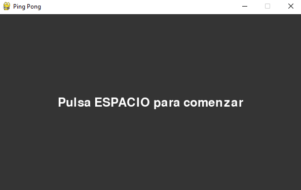
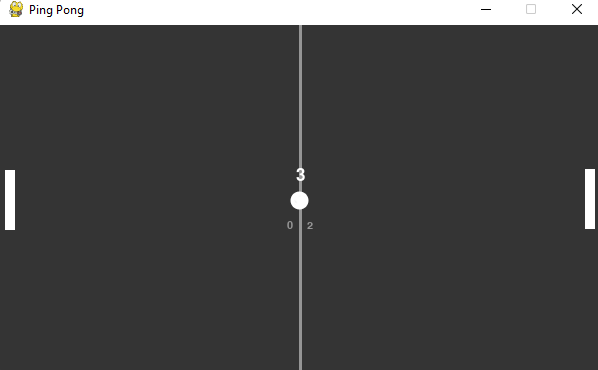

# Ping Pong con Pygame

Juego indie sencillo de Ping Pong con marcador y cuenta atrás tras marcar. Gracias a la librería **pygame (version 2.1.1)** podemos crear un entorno 2D donde simulamos un pelota y dos jugadores. 

El juego dispone de una pantalla de inicio para que le jugador pueda prepararse



Tras pulsar `SPACE` debería de acceder a la pantalla de juego, donde tiene 3 segundos hasta que la bola salga en una dirección aleatoria. Este comportamiento ocurre siempre que se consiga hacer un tanto. 



## Descargar

1. Clone el repositorio desde su bash en la ubicación en la que desea tenerlo:
```
> git clone https://github.com/nachoperezzv/PingPong.git
```

2. Cree el entorno virtual de python para no modificar sus bibliotecas personales y asegurarse de que se descarga la versión correcta de **pygame**. Puede hacerlo de la siguiente forma , estando en la misma ubicación que en el paso anterior:

```
> python -m venv PingPong
```

3. Acceda a la carpeta:
```
> cd PingPong
```

4. Deberá activar su entorno virtual. Por convención, con `venv` debería de disponer de un directorio de nombre `Scripts`. Acceda a el y luego ejecute el siguiente comando. 

    - Desde `cmd`:
    ```
    cd Scripts
    .\activate.bat
    ```

    - Desde `terminal` (linux):
    ```
    source \Scripts\.activate.bat
    ```

5. Una vez ha generado y activado su entorno virtual, instale los paquetes:

```
python install -r requirements.txt
```


## Compilar

Este dato es importante puesto que se debe compilar exclusivamente desde la carpeta `/src`. Si se hace desde la carpeta general de `/PingPong` provocará un fallo. 

```
C:\Users\user\PingPong\src\python main.py 
```

## Jugador 

El jugador a controlar es el de la izquierda. El oponente se encuentra a la derecha y sigue un movimiento para tratar de mantener la pelota siempre en su centro siempre que esta a una distancia en el eje x que no sea mayor a la indicada. Esto es para tratar de simular un comportamiento lógico, pero sencillo, de la lógica que tiene que seguir un jugador. 

### Controles

Para mover a nuestro jugador utilizaremos las flechas de nuestro teclado. 


